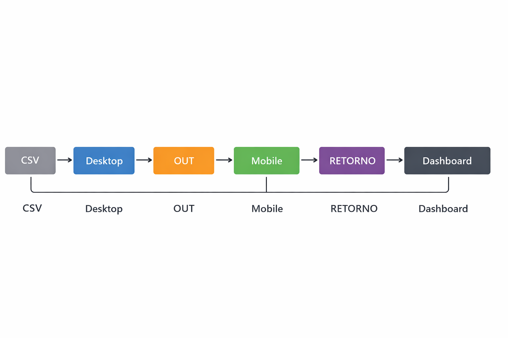
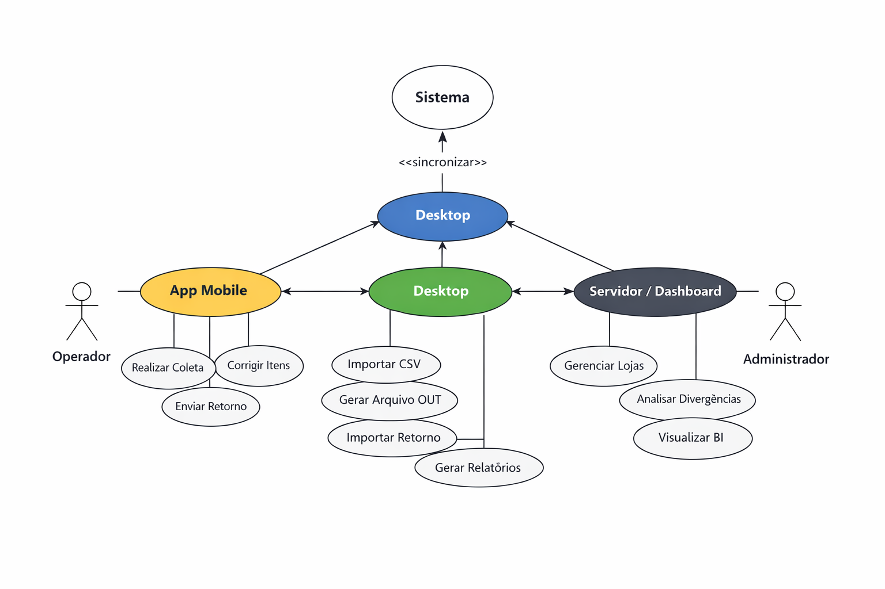

<div align="center">

# 🚀 Inventário Híbrido  
### 📱 Coleta Offline • 💻 Processamento Local • 📊 Análise Inteligente

Sistema completo para gestão de inventários no varejo, projetado para velocidade, precisão e escalabilidade.

---

### 📞 Contato  
💬 **WhatsApp:** https://wa.me/5562993747844  
📧 **E-mail:** claudio.vinicius48@gmail.com  

---

<p align="center">
  
  
  
  
  
</p>

</div>

---

## 📑 Sumário
- 📦 [Visão Geral](#-visão-geral)
- 🧱 [Estrutura do Projeto](#-estrutura-do-projeto)
- 🛠️ [Tecnologias Utilizadas](#-tecnologias-utilizadas)
- 📁 [Estrutura de Pastas](#-estrutura-de-pastas)
- 📊 [Diagramas](#-diagramas)
- ✅ [Status do Projeto](#status-do-projeto)
- 📄 [Documentação](#-documentação)
- ⚙️ [Instalação e Execução](#-instalação-e-execução)
- ▶️ [Exemplos de Uso](#-exemplos-de-uso)
- 📌 [Observações](#-observações)
-  🛠️ [Equipamentos Necessários](#-equipamentos-necessários)

---

## 📦 Visão Geral
Sistema completo para gestão de inventários no varejo, com coleta offline, processamento local e análise inteligente.

## 🧱 Estrutura do Projeto
- **Mobile (Android)** — coleta offline, leitura de código de barras, geração de retorno.  
- **Desktop (Windows)** — processamento de inventário, geração de OUT, relatórios.  
- **Servidor/API + Dashboard** — histórico, BI, divergências, multi-loja.  

## 🛠️ Tecnologias Utilizadas
- C# (.NET 6+), WPF  
- SQLite (mobile e desktop)  
- Node.js ou .NET API  
- MySQL (servidor)  
- React (dashboard)  
- JWT (autenticação)  

## 📁 Estrutura de Pastas
- `Mobile/` — código-fonte do app Android  
- `Desktop/` — aplicação Windows  
- `API/` — backend com endpoints REST  
- `Dashboard/` — frontend React  
- `Scripts/` — utilitários e testes  
- `Diagramas/` — arquitetura, fluxo operacional e ERD  
- `Documentação/` — resumos executivos, técnicos e para investidores  
- `Relatórios/` — relatórios gerados pelo sistema  

---

## 📊 Diagramas

### 🔄 Diagrama de Fluxo


### 👥 Casos de Uso UML


### 🗄 Modelo de Dados ERD


---

## ✅ Status do Projeto
- ✅ Diagrama de fluxo concluído  
- ⚠️ Casos de uso em revisão  
- ⏳ Modelo de dados aguardando validação  

---

## 📄 Documentação
- Swagger/OpenAPI para API  
- Diagramas UML e ERD  
- Fluxo operacional disponível em `Documentação/UML` e `Documentação/ERD`  

---

## ⚙️ Instalação e Execução


### 💻 Desktop (Windows)
```bash
dotnet build
dotnet run

📱 Mobile (Android)
• 	Abra no Android Studio
• 	Compile e instale no dispositivo
• 	Importe o arquivo OUT.csv gerado pelo Desktop
🌐 Servidor/API
npm install
npm start

📊 Dashboard
npm install
npm start

▶️ Exemplos de Uso
• 	💻 Desktop: importar CSV do cliente e gerar OUT
• 	📱 Mobile: coletar itens offline e gerar RETORNO
• 	💻 Desktop: importar RETORNO e gerar relatórios
• 	🌐 Servidor/Dashboard: visualizar BI, divergências e produtividade

📌 Observações
• 	Funciona 100% offline
• 	Arquivos de entrada/saída: OUT.csv / RETORNO.csv
• 	Relatórios automáticos e painel de progresso

---

# 🛠️ Equipamentos Necessários

## 📱 Coleta (Mobile)
- Android 8.0 ou superior  
- 2 GB RAM  
- 16 GB armazenamento  
- Tela 5" ou maior  
- Bluetooth (opcional)  
- Leitor de código de barras (opcional)  

**Modelos recomendados:**  
- Samsung A03 / A14  
- Motorola E22 / G13  
- Coletores profissionais: Zebra, Gertec, Honeywell  

---

## 💻 Processamento (Desktop)
- Windows 10 ou superior  
- Processador i3 ou equivalente  
- 4 GB RAM  
- 10 GB livres  
- Porta USB (para importar arquivos)  

**Recomendado:**  
- Processador i5  
- 8 GB RAM  
- SSD  

---

## 🌐 Servidor (Opcional)
Para histórico e dashboard online:

- Linux ou Windows Server  
- 2 vCPUs  
- 4 GB RAM  
- Banco MySQL  
- Firewall configurado  
- HTTPS habilitado  

**Plataformas recomendadas:**  
- Azure  
- AWS  
- Hostinger  
- DigitalOcean  

